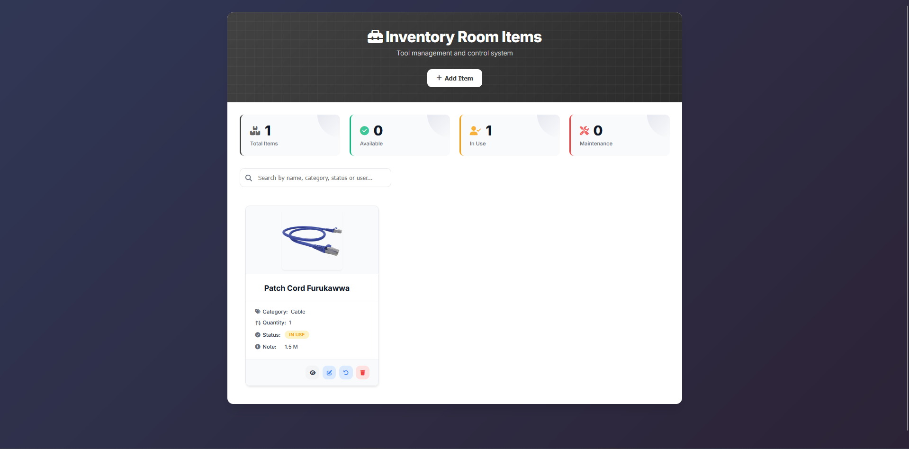
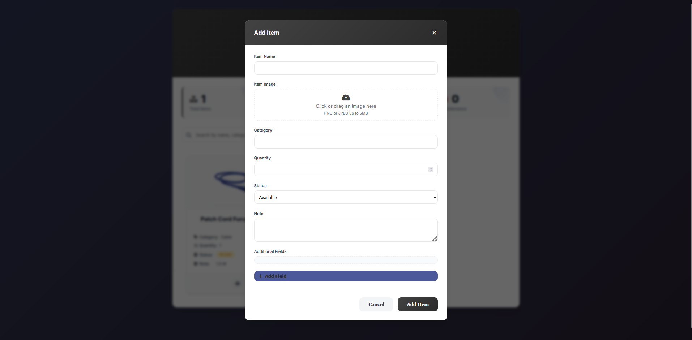
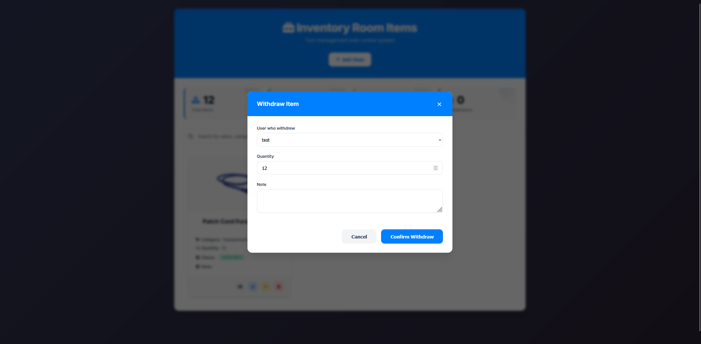

# Simple Stock Internal Web App

# HomePage
On this page, you'll see an overview of every item in your stock, with information such as name, type, and quantity. You can also add new items using the "Add Items" button.

    

# Register Modal
This modal allows you to register any item you need, with unlimited possibilities. You can add as many fields as necessary.

    

# Details Modal
Since items can have many fields, we created a details modal to display all of them. Here, you can see every detail related to a specific item.

    

# WithDraw Modal
This modal is used to document who is taking the item and how many units are being withdrawn.

    

This app is for internal use only due to security issues. It's just a quick project to help a few people. It will work properly, but because of the library versions and the image-sending method, the code is not secure to be exposed online. Maybe I’ll fix it in the future 😎

